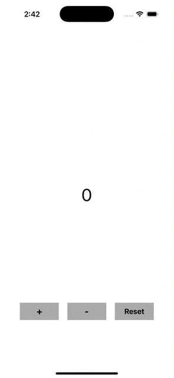

# 카운터 앱 프로젝트

### 학습 목표
1. UIKit 기본 컴포넌트 활용: UIButton, UILabel 등 주요 UI 구성 요소 익히기
2. 사용자 이벤트 처리: 버튼 클릭 시 동작 구현
3. Auto Layout: 다양한 화면 크기에서도 정상적으로 동작하는 UI 배치 연습
4. 변수와 데이터 변경: Swift에서 상태(변수) 업데이트 방식 이해

### 구현할 기능
1. 숫자 증가/감소:
    - `+` 버튼을 클릭하면 숫자가 1씩 증가
    - `-` 버튼을 클릭하면 숫자가 1씩 감소
2. 초기화 기능:
    - `Reset` 버튼을 클릭하면 숫자가 0으로 초기화
3. 현재 숫자 표시:
    - 중앙에 UILabel로 현재 숫자를 표시

### 요구 사항
1. UILabel:
    - 화면 중앙에 현재 숫자 표시
    - 초기 값은. 0` 으로 설정
2. UIButton:
    - 하단에 `+` 버튼, `-` 버튼, `Reset` 버튼을 수평으로 배치
    - 각각의 버튼은 각 기능(증가, 감소, 초기화)을 담당
3. Auto Layout:
    - 모든 UI 컴포넌트는 Auto Layout을 사용해 배치

### 추가 도전 과제
1. 최대/최소 값 설정
    - 증가/감소 값이 특정 범위를 초과하지 않도록 제한(예: `-10 ≤ count ≤ 10`)
2. 버튼 활성화/비활성화
    - 최소 값(-10)일 때 `-` 버튼 비활성화, 최대 값(10)일 때 `+` 버튼 비활성화

### 이슈 및 해결방안
1. 버튼 비활성화 시 버튼 자체가 터치되지 않을 뿐 시각적으로 비활성화가 확인되지 않음
    - 비활성화 시 버튼의 `alpha` 값을 0.5로 조절하여 버튼이 반투명하게 보이도록 함

### 결과물

